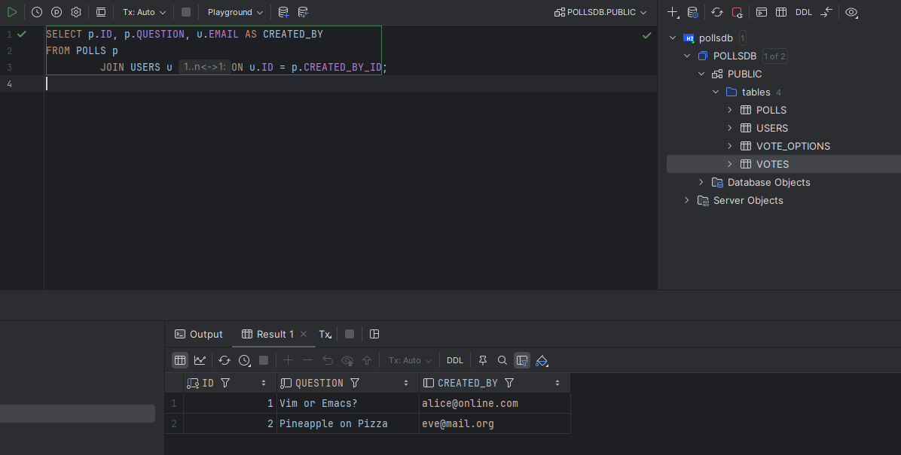
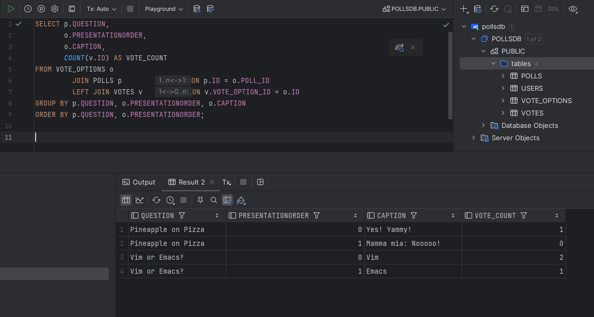

Software Technology Experiment Assignment 4: ORM with JPA

For this assignment i had a lot of difficulties with integrating JPA with my current project. Id chalk it up to my code
being a buggy mess. Trying to integrate the JPA part, i couldnt find a feasable way to get past an assertion error
related to the voting logic, line 81 in the domain test, without restructuring the existing project. I didnt want to
make any major changes to my JPA logic, as the automatic tests and my manual testing didnt have any problems. In the end
I decided to comment out my changes, and isolate the JPA structure within the test directory, as to make the tests pass.

Link to experiment 2(same repo): https://github.com/h669826/DAT250ex2

To test that my JPA structure was indeed correct i used the IntelliJ database tool to query towards a file that i
specified be created by the entity manager upon running the test. Here are two examples of queries, one to see the
relation between creator and poll, and one to show amount of votes per caption.

Pending issues:
Voting logic broken for integrated version